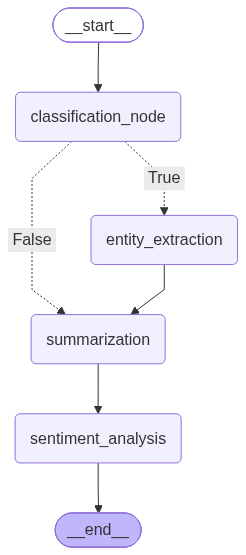

# LangGraph Text Analysis Pipeline

A LangGraph pipeline that classifies text, conditionally extracts entities, summarizes, and analyzes sentiment. Runs on the free Groq API (`openai/gpt-oss-20b`).

## Graph structure



- `classification_node` routes conditionally: News/Research → `entity_extraction` → `summarization`; Blog/Other → straight to `summarization`.
- All paths converge at `sentiment_analysis` before `END`.

## Setup

```
pip install -r requirements.txt
```

Add your free Groq API key ([console.groq.com/keys](https://console.groq.com/keys)) to `.env`:

```
GROQ_API_KEY=your-key-here
```

Run:

```
python LangGraph.py
```

## Sample results

| Text | Classification | Entities | Sentiment |
|---|---|---|---|
| GPT-4 announcement | News | OpenAI | Neutral |
| Quantum computing | News | MIT, Google | Neutral |
| GPT-4 breakthrough | News | OpenAI | Positive |
| Meditation blog | Blog | Skipped | Positive |
